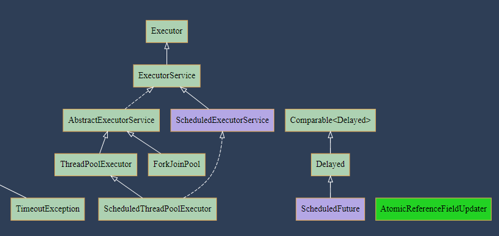

## Classviz : A Tool for class dependencies visualization

### maven repository
maven repository
```java

```

### Usage
we can generate class dependencies via classviz.
```java
Classviz classviz = ClassvizGeneration.scan(pathToJavaFiles);
classviz.setFormat(Format.SVG);
classviz.exportToFile(new File(fileDestination));
```


### Referred OR Inspired Projects
1. [https://github.com/nidi3/graphviz-java](https://github.com/nidi3/graphviz-java)
2. [https://github.com/javaparser/javaparser](https://github.com/javaparser/javaparser)
3. [https://github.com/plantuml/plantuml](https://github.com/plantuml/plantuml)
4. [https://github.com/mountainstorm/jquery.graphviz.svg](https://github.com/mountainstorm/jquery.graphviz.svg)


