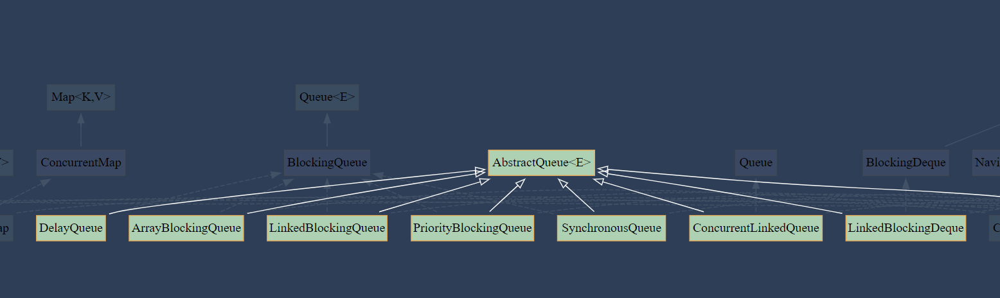

## Classviz : A Tool for class dependencies visualization

### maven repository
maven repository
```java

```

### Usage
We can generate class dependency graph via **Classviz**.
```java
Classviz classviz = ClassvizGeneration.scan(pathToJavaFiles);
classviz.setFormat(Format.SVG);
classviz.exportToFile(new File(fileDestination));
```


With the [jquery.graphviz.svg](https://github.com/mountainstorm/jquery.graphviz.svg), we can track class dependencies and its dependents. The tracking classes are highlight.


### Demo with [jquery.graphviz.svg](https://github.com/mountainstorm/jquery.graphviz.svg)
[Demo site](https://physicslovejava.github.io/classviz/)

### Inspiring Projects
1. [https://github.com/nidi3/graphviz-java](https://github.com/nidi3/graphviz-java)
2. [https://github.com/javaparser/javaparser](https://github.com/javaparser/javaparser)
3. [https://github.com/plantuml/plantuml](https://github.com/plantuml/plantuml)
4. [https://github.com/mountainstorm/jquery.graphviz.svg](https://github.com/mountainstorm/jquery.graphviz.svg)


